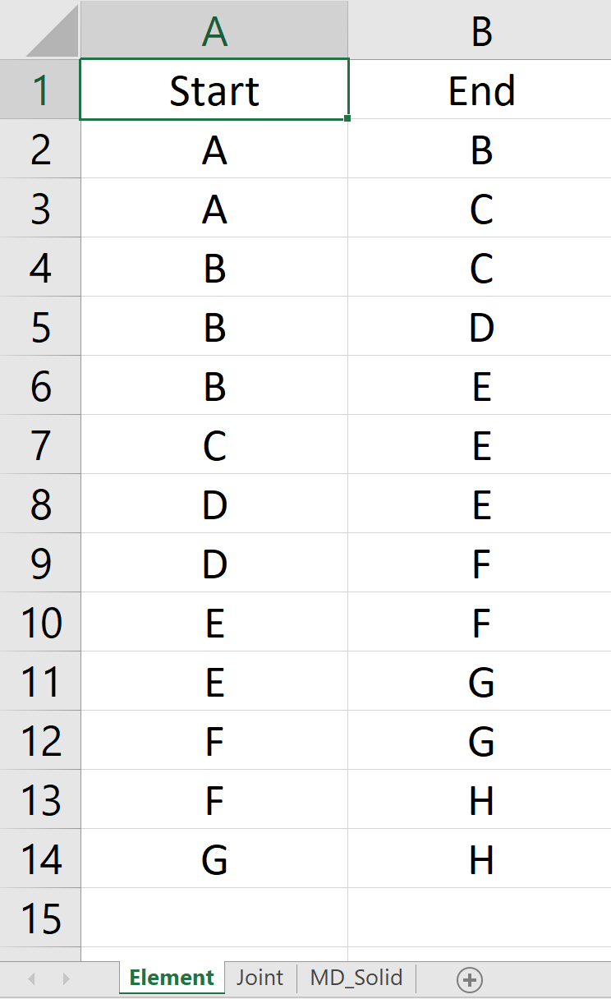
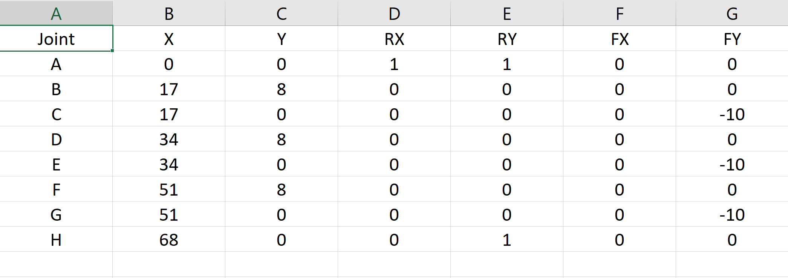
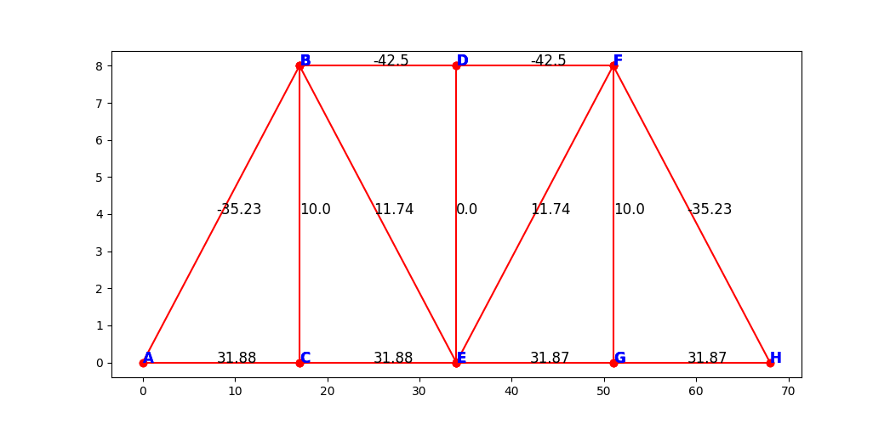

# Truss Solver (Plugin-Based Architecture)

A Python application that reads truss geometry and loading conditions from Excel files, solves the internal member forces and support reactions, and then plots the resulting truss. The solver is organized in a plugin‐based architecture for easy extensibility and maintenance.

## Table of Contents

- [Overview](#overview)
- [Project Structure](#project-structure)
- [Dependencies](#dependencies)
- [Data Format](#data-format)
  - [Element Sheet](#element-sheet)
  - [Joint Sheet](#joint-sheet)
- [Usage](#usage)
  - [1. Prepare Data Files](#1-prepare-data-files)
  - [2. Run the Solver](#2-run-the-solver)
- [Generating Sample Data](#generating-sample-data)
- [How It Works](#how-it-works)
  - [Data Loading](#data-loading)
  - [Reaction Solver](#reaction-solver)
  - [Element Solver](#element-solver)
  - [Plotter](#plotter)
- [Contributing](#contributing)
- [License](#license)

---

## Overview

This repository contains a **truss solver** that:
1. Reads truss configuration (joints, elements, supports, loads) from Excel sheets.
2. Calculates support reactions.
3. Solves internal forces in each truss element.
4. Plots the truss geometry with the computed forces.

By employing a **plugin-based architecture**, each step in the workflow (data loading, reaction solving, element solving, and plotting) is encapsulated in its own Python module. This structure makes it easy to extend or replace individual components (e.g., switch from Excel to CSV input, or use a different plotting library).

In this project, we analyze structural elements, visualize the connectivity (joins), and examine output results. We use the following images to illustrate each step:

1. **elements.png**  
     
   This diagram shows the main structural elements used in the model.

2. **joins.png**  
     
   This image highlights how elements are joined or connected within the model.

3. **output.png**  
     
   Here, we have a snapshot of the basic output (e.g., displacement plots, stress contours) after running the analysis.

4. **output from staad pro.png**  
     
   This is a sample result taken directly from STAAD Pro, illustrating the software’s final output screen for the structural analysis.

---

## Project Structure

A typical layout of this project is:

```bash
truss_solver/
├── data/
│   ├── Ex1.xlsx              # Example data file (Elements)
│   ├── Ex2.xlsx              # Example data file (Joints)
├── plugins/
│   ├── __init__.py
│   ├── data_loader.py        # Plugin for reading Excel data
│   ├── reaction_solver.py    # Plugin for computing reactions
│   ├── element_solver.py     # Plugin for solving element forces
│   └── plotter.py            # Plugin for plotting the results
├── images/
│   ├── elements.png          # Elements data
│   ├── joins.png             # Joins data
│   ├── output.png            # Output from software
│   └── output from staad pro.png # Output from staad pro
├── main.py                   # Main entry point
├── requirements.txt          # List of Python dependencies (optional)
└── README.md
```
---

## Dependencies

- Python 3.7+
- [pandas](https://pandas.pydata.org/)
- [numpy](https://numpy.org/)
- [matplotlib](https://matplotlib.org/)
- [openpyxl](https://openpyxl.readthedocs.io/) (for Excel I/O)
- [statistics](https://docs.python.org/3/library/statistics.html) (standard library for Python 3.8+)

You can install the necessary packages via:

```bash
pip install -r requirements.txt
```

## Data Format

Your Excel file(s) should contain at least two sheets: **Element** and **Joint**. The code in `data_loader.py` expects these sheet names.

### Element Sheet

| Start | End |
|-------|-----|
| A     | B   |
| B     | C   |
| C     | D   |

- **Start** and **End**: The labels of the joints that define each truss member.

### Joint Sheet

| Joint | X   | Y   | RX | RY | FX  | FY  |
|-------|-----|-----|----|----|-----|-----|
| A     | 0   | 0   | 1  | 0  | 0   | 0   |
| B     | 10  | 0   | 0  | 0  | 0   | -10 |
| C     | 20  | 0   | 0  | 0  | 0   | 0   |

- **Joint**: Unique label for each joint (A, B, C, …).
- **X, Y**: Coordinates of each joint.
- **RX, RY**: Reaction flags (1 indicates a support in that direction; 0 means free).
- **FX, FY**: External loads applied at the joint (positive or negative).

*(You can rename these columns or add more columns if needed, but make sure to update your plugins accordingly.)*


## Usage

### 1. Prepare Data Files

1. Place your Excel files (`Ex1.xlsx`, `Ex2.xlsx`, or `truss_data.xlsx`) in the `data/` folder.  
2. Ensure each file contains the **Element** and **Joint** sheets (unless you are using two separate files and have updated the code accordingly).

### 2. Run the Solver

```bash
python main.py
```

## Generating Sample Data

For testing or demonstration, you can create a small Python script to generate sample Excel files. For example:

```python
import pandas as pd

# Sample elements
elements_data = {
    "Start": ["A", "B", "B"],
    "End":   ["B", "C", "D"]
}
elements_df = pd.DataFrame(elements_data)

# Sample joints
joints_data = {
    "Joint": ["A", "B", "C", "D"],
    "X":     [0,    10,   20,   10],
    "Y":     [0,    0,    0,    10],
    "RX":    [1,    0,    0,    0],
    "RY":    [1,    0,    0,    0],
    "FX":    [0,    0,    0,    0],
    "FY":    [0,    -10,  0,    0]
}
joints_df = pd.DataFrame(joints_data)

# Write to a single Excel file
with pd.ExcelWriter("sample_truss_data.xlsx", engine="openpyxl") as writer:
    elements_df.to_excel(writer, sheet_name="Element", index=False)
    joints_df.to_excel(writer, sheet_name="Joint", index=False)
```

## How It Works

### Data Loading
- **`plugins/data_loader.py`**  
  Reads the **Element** and **Joint** sheets from Excel using **pandas**. Returns two pandas DataFrames, `elements` and `joints`.

### Reaction Solver
- **`plugins/reaction_solver.py`**  
  - Identifies which joints have supports (based on `RX` and `RY` flags).  
  - Assembles and solves the equilibrium equations in the X, Y, and moment directions to find support reactions.  
  - Updates the `RX` and `RY` columns in the `joints` DataFrame with the computed values.

### Element Solver
- **`plugins/element_solver.py`**  
  - Iteratively solves for unknown member forces by applying equilibrium at each joint.  
  - Uses the geometry (coordinates of the joints) to determine direction cosines for each element.  
  - Once a member force is found, it updates the data and moves on to the next unknown.

### Plotter
- **`plugins/plotter.py`**  
  - Uses **matplotlib** to draw the truss based on each joint’s X and Y coordinates.  
  - Annotates each member with its computed force value and each joint with its label.
